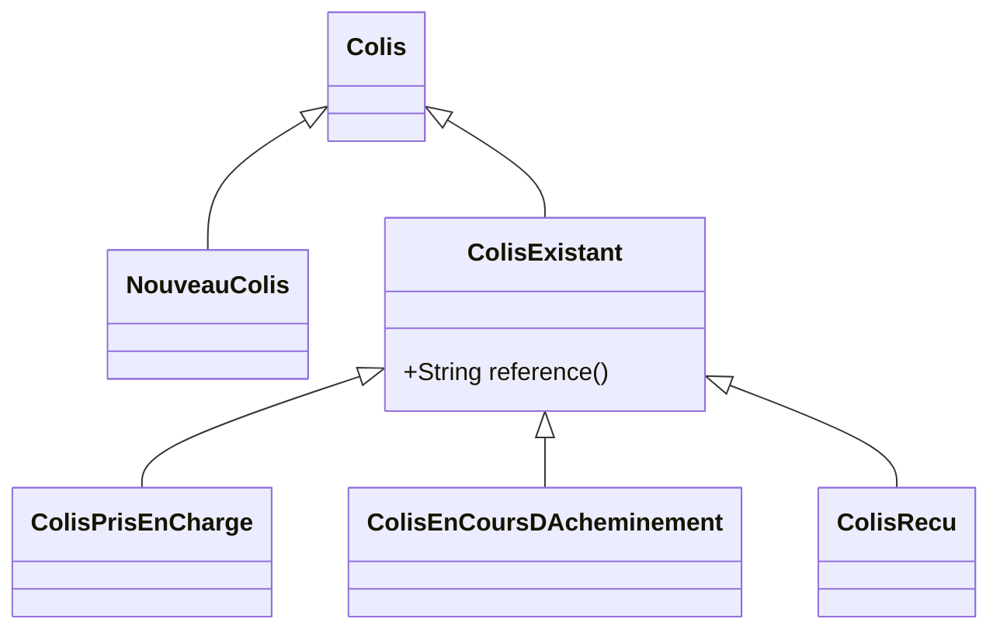

# Illustration des patterns java 21 

## Les nouveautés du jdk 

Le jdk 21 introduit de nouvelles fonctionnalités (record, sealed class, pattern matching) qui comme les generic ou les lambda vont impacter la façon de développer en java. 

Ce workshop permet de prendre en main ces nouvelles fonctionnalités et de les mettre en œuvre à travers des cas pratiques. 

Pendant 3 heures, nous allons refactorer une application en utilisant ces nouveaux patterns pour rendre le code plus robuste, et profiter un peu plus de l'aide du compilateur java. 


### Les records 

Les records sont un nouveau type de class qui permet de représenter un type produit. 
On peut les utiliser en remplacement des traditionnels POJO, on peut également les voir comme un tuple auquel on aurait donné un nom. 

Pour déclarer un record : 

```java
record Chien(String nom, Integer age) { }
```

Il est également possible de faire des choses à la construction de l'instance 

```java
record Chien(String nom, Integer age) {
    public Chien { // ici, on n'est pas obligé de rappeler les attributs 
        nom = Objects.requireNonNullElse(nom, "Médor");
        Objects.requireNonNull(age, "l'age est obligatoire");
    }
    
    // On peut également écrire d'autres constructeurs 
    public Chien(Integer age) {
        this("Médor", age);
    }
}
```

Le record est immutable (les attributs sont finals). Pour modifier un attribut, il faudra créer une nouvelle instance : 

```java
record Chien(String nom, Integer age) {
    public Chien nom(String nom) {
        return new Chien(nom, age);
    } 
}
```

Un equals et hash code est automatiquement généré à partir de tous les attributs.

Des accesseurs sont également générés :

```java
Chien medor = new Chien("Médor", 5);

String nom = medor.nom();
```

Le record est une classe finale et ne peut pas être étendu. 

### Les interfaces scellées 

Le mot clé sealed permet de définir une liste finie de classes qui vont étendre une classe parente. Il peut être utilisé avec les classes, les classes abstraites ou les interfaces. 

Par ex : 

```java
sealed interface Animal permits Animal.Chien, Animal.Chat {
    record Chien(String nom) implements Animal {}
    record Chat(String nom) implements Animal {}
}
```
Dans cet exemple `permits` pourrait être omis car les sous classes sont dans le même fichier. 

Les sealed classes viennent avec quelques contraintes :
* les sous classes doivent être dans la même classe ou le même package 
* les sous classes doivent être des classes finales (le record est final)

Il est possible de définir une hiérarchie en utilisant les classes abstraites ou les interfaces. 

```java
sealed interface Animal  {
    
    sealed interface AnimalSauvage extends Animal {}
    
    sealed interface AnimalDeCompagnie extends Animal {}
    
    record Lion(String nom) implements AnimalSauvage {}
    
    record Chien(String nom) implements AnimalDeCompagnie {}
    
    final class Chat implements AnimalDeCompagnie {
        public String nom;
        public Chat(String nom) {
            this.nom = nom;
        }
    }
}
```


### Le pattern matching 

Depuis le jdk 17, le `if (any instanceof Class)` a grandement été amélioré. 

#### Le if avec instanceof 

Lorsqu'on devait faire : 

```java
void ifMethode() {
    if (uneInstance instanceof MonObject) {
        MonObject monObject = (MonObject) uneInstance;
    }
}
```

Maintenant avec le "type pattern" on peut écrire

```java
void ifMethode() {
    if (uneInstance instanceof MonObject monObject) {

    }
}
```

Mais on peut aller plus loins en ajoutant des tests supplémentaires sur l'instance qui a été casté 

```java
void ifMethode() {
    if (uneInstance instanceof MonObject monObject && monObject.value().equals("test")) {

    }
}
```

On peut également "déstructurer" des records avec le "Record pattern" en plus de tester leur type 

```java
void ifMethode() {
    if (uneInstance instanceof Chien(var nom) && nom.equals("Médor")) {

    }
}
```

##### le if et les classes scellées 

La ou les classes scellées deviennent vraiment intéressantes, c'est en les utilisant avec un if. En effet, le compilateur va tester l'exhaustivité des cas et le else ne sera plus nécessaire. 

```java
void ifMethode() {
    if (animal instanceof Animal.Chat(var nom)) {

    } else if (animal instanceof Animal.Chien chien) {

    }
}
```

Un des problèmes du if, c'est que ça n'est pas une expression, on ne peut donc pas faire : 

```java
void ifMethode() {
    String nomAnimal = if (animal instanceof Animal.Chat(var nom)) {
        return nom;
    } else if (animal instanceof Animal.Chien(var nom)) {
        return nom;
    }
}
``` 
Heureusement, il existe le switch 

### le switch et le pattern matching 

Le switch permet de tester plusieurs cas et de retourner une valeur. 

```java
void switchMethode() {
    var result = switch (monObject) {
        case String string -> string;
        case Integer integer -> "Entier %s".formatted(integer);
        default -> "Inconnu";
    };
}
```
Le switch est une expression, on peut donc affecter le résultat à une variable. 

Comme pour le if, on peut déstructurer des records et le compilateur peut checker l'exhaustivité des cas pour les sealed class. 

On peut également tester des conditions supplémentaires en utilisant le "guard pattern" avec le mot clé when. 

Si le cas à traiter se fait sur plusieurs lignes, il faudra utiliser `yield`et non `return` pour retourner un résultat. 

Tout mis bout à bout donne :

```java
void switchMethode() {
    String age = switch (animal) {
        case Animal.Chat chat -> chat.nom() + " n'a pas d'age";
        case Animal.Chien(var leNom, var ageDuChien) when ageDuChien > 18 -> leNom + " est majeur " + ageDuChien;
        case Animal.Chien(var leNom, var ageDuChien) -> {
            String nom = leNom + " est mineur " + ageDuChien;
            yield nom;
        }
    };
}
```

On peut aller encore plus et tester des combinaisons 

```java
void switchMethode() {
    // Il est possible de déclarer un record à l'intérieur d'une méthode 
    record Jai2Animaux(Animal animal1, Animal animal2) { }

    Animal animal2 = new Animal.Chien("Medor", 5);

// Ici le compilateur va vérifier tous les cas : 
    String cas = switch (new Jai2Animaux(animal, animal2)) {
        case Jai2Animaux(Animal.Chien chien1, Animal.Chien chien2) -> "J'ai 2 chiens";
        case Jai2Animaux(Animal.Chat chat1, Animal.Chat chat2) -> "J'ai 2 chat";
        case Jai2Animaux(Animal.Chien chien1, Animal.Chat chat2) -> "J'ai 1 chien et 1 chat";
        case Jai2Animaux(Animal.Chat chat1, Animal.Chien chien2) -> "J'ai 1 chien et 1 chat";
    };
}
```

### Astuces 

Petit trick rigolo pour gérer une liste, on veut "filtrer et caster" pour ne garder que les chiens :  

```java
List<Animal> animals = List.of();
List<Animal.Chien> chiens = animals
        .stream()
        .flatMap(a -> switch (a) {
            case Animal.Chien c -> Stream.of(c);
            default -> Stream.of();
        })
        .toList();
```

Voici une autre astuce pour pouvoir utiliser le switch avec un `Optional`. 

D'abord, on va créer un petit utilitaire : 

```java
public sealed interface Opt<T> {
    record Present<T>(T value) implements Opt<T> {}
    record Empty<T>() implements Opt<T> {}
}
```
Ici, on vient de créer une sealed interface qui prend 2 valeurs : Present ou Vide. 

On va ensuite s'équiper d'une factory à partir d'un optional : 
```java
public static <T> Opt<T> opt(Optional<T> optional) {
    return optional.<Opt<T>>map(Opt.Present::new).orElse(new Opt.Empty<>());
}
```

Maintenant, on peut écrire ce code : 

```java
Optional<String> stringOrVide = Optional.of("C'est pas vide");

String resultat = switch (opt(stringOrVide)) {
    case Opt.Present(var value) -> value;
    case Opt.Empty() -> "c'est vide";
};
```

## L'exercice 

Le but du workshop et d'utiliser les nouvelles fonctionnalités du jdk pour refactorer une application de gestion de colis. 

Les colis sont représentés ainsi : 

```java
public class Colis {
    public String reference;
    @NotNull
    public TypeColis type;
    @NotNull
    public LocalDateTime dateDEnvoi;
    public LocalDateTime dateReception;
    public Double latitude;
    public Double longitude;
    @Email
    @NotNull
    public String email;
    public Adresse adresse;
}
```

Le but est de réécrire le Colis sous la forme d'une interface scellée représentant tous les états possibles. 

Il faudra ensuite adapter et refactorer le service `LivraisonDeColis` pour prendre en compte ce nouveau design de classe.  

Le code a refactorer se trouve dans le package `fr.maif.patternjava.app`.


### Étape 1 : utilisation des records 

Transformer la class `Colis` en `record`. 
La validation sera fait iso avec les annotations. Des valeurs par défaut peuvent être mise dans le constructeur si besoin. 

### Étape 2 : refactorer l'adresse

On voit que l'adresse est soit AdresseBtoB, soit AdresseBtoC. L'adresse peut donc être réécrite avec une sealed interface et des records.  

Adresse B2B :
 * raisonSocialeOuDenomination : non null, taille 38
 * identiteDestinataireOuService : non null, taille 38
 * entreeBatimentImmeubleResidence : taille 38
 * numeroLibelleVoie : non null, taille 38
 * mentionSpecialeEtCommuneGeo : taille 38
 * codePostalEtLocaliteOuCedex : non null, taille 38
 * pays: taille 38

Adresse B2C :
 * civiliteNomPrenom : non null, taille 38
 * noAppEtageCouloirEscalier : taille 38
 * entreeBatimentImmeubleResidence : taille 38
 * numeroLibelleVoie : non null, taille 38
 * lieuDitServiceParticulierDeDistribution : taille 38
 * codePostalEtLocaliteOuCedex : non null, taille 38
 * pays : taille 38

**Note importante /!\ :**

Pour sérialiser / désérialiser avec Jackson, il faut un attribut qui permet de savoir comment lire le json dans le bon format. 
Ici, on pourra utiliser l'attribut `type` qui prendra les valeurs `AdresseBtoB` et `AdresseBtoC`. 

Pour faire avec Jackson, on utilisera les annotations `@JsonTypeInfo` et `@JsonSubTypes` ainsi :

```java
@JsonTypeInfo(
        use = JsonTypeInfo.Id.NAME,
        property = "type"
)
@JsonSubTypes({
        @JsonSubTypes.Type(
                value = Adresse.AdresseBtoB.class,
                name = "AdresseBtoB"
        ),
        @JsonSubTypes.Type(
                value = Adresse.AdresseBtoC.class,
                name = "AdresseBtoC"
        )}
)
```


### Etape 3 : refactorer le colis 

À l'image de l'adresse, on voit que le colis a plusieurs états. Le but : refactorer le colis avec une hiérarchie de sealed interface et de records. 

Les règles de gestion sur le colis : 
 * NouveauColis : email et adresse non null, adresse valide 
 * ColisPrisEnCharge : reference, email, adresse et date d'envoi non null, adresse valide
 * ColisEnCoursDAcheminement : reference, email, adresse, date d'envoi et latitude / longitude non null, adresse valide
 * ColisRecu : reference, email, adresse, date d'envoi et date de reception non null, adresse valide

À cette étape, vous pouvez mettre en commentaire le contenu des méthodes `prendreEnChargeLeColis` et `gererColis` : 

```java
public Colis prendreEnChargeLeColis(Colis colis) throws EtatInvalide {
    return colis;    
}
public Colis gererColis(Colis colis) {
    return colis;
}
```
**Tips :**
Un colis qui n'existe pas encore n'a pas de reference, c'est le cas d'un NouveauColis. 

Il est possible de gérer ça dans la hiérarchie de classes : 



Comme il est maintenant possible de séparer les cas `Colis` et `ColisExistant`, le repository `ColisExistants` peut être adapté pour gérer que des `ColisExistant`.  


### Étape 4 : adapter le service LivraisonDeColis pour les nouveaux Colis 

Plus rien ne compile ! Ou alors avec des lignes en commentaires

Pour commencer, on va refactorer la méthode `prendreEnChargeLeColis`. 

Si le colis est un `NouveauColis`, il faut le persister, sinon il faut lever une exception. 


### Étape 5 : adapter le service LivraisonDeColis pour les colis existants

On va maintenant adapter la méthode `gererColis`. Pourquoi ne pas utiliser un `switch` pour valider la cohérence des cas.

Les règles sont les suivantes :
 * Sur le POST : création d'un colis, le type de colis doit être `NouveauColis` 
 * Sur le PUT : modification d'un colis :
   * le type de colis ne pas doit être `NouveauColis`
   * un colis doit exister pour cette référence
   * la maj est possible si le 
     * colis existant est `ColisPrisEnCharge` et le colis a maj est `ColisEnCoursDAcheminement`
     * colis existant est `ColisEnCoursDAcheminement` et le colis a maj est `ColisEnCoursDAcheminement`
     * colis existant est `ColisEnCoursDAcheminement` et le colis a maj est `ColisRecu`
     * colis existant est `ColisPrisEnCharge` et le colis a maj est `ColisEnCoursDAcheminement` et que la date d'envoi a dépassé 1 mois, dans ce cas, il faut lever une erreur.
     * dans les autres cas : la demande est invalide 

**Tips :**

Comme vu dans la présentation des nouveautés du jdk, il est possible de déclarer un record à la volée pour l'utiliser dans un switch. Ceci peut être utilisé pour comparer l'entrée venant de la base avec la donnée utilisateur :

```java
void switchMethode() {
    // Il est possible de déclarer un record à l'intérieur d'une méthode 
    record Jai2Animaux(Animal animal1, Animal animal2) { }

    Animal animal2 = new Animal.Chien("Medor", 5);

// Ici le compilateur va vérifier tous les cas : 
    String cas = switch (new Jai2Animaux(animal, animal2)) {
        case Jai2Animaux(Animal.Chien chien1, Animal.Chien chien2) -> "J'ai 2 chiens";
        case Jai2Animaux(Animal.Chat chat1, Animal.Chat chat2) -> "J'ai 2 chat";
        case Jai2Animaux(Animal.Chien chien1, Animal.Chat chat2) -> "J'ai 1 chien et 1 chat";
        case Jai2Animaux(Animal.Chat chat1, Animal.Chien chien2) -> "J'ai 1 chien et 1 chat";
    };
}
```

### Étape 6 : alternative aux exceptions

Et si les erreurs étaient aussi un état du colis. Modifier la hiérarchie de classe pour intégrer les erreurs. Il faudra refactorer le controller pour gérer proprement les erreurs.

### Etape 7 : Validation par des types dédiés

Dans cette approche, on remplace les annotations "bean validation" par un type dédié et des validations dans le constructeur. 

Par exemple :

```java
String email;
```
devient 

```java
Email email;
```

avec 

```java
record Email(String email) {
    public Email {
        // valider la regex de l'email ici et lever une exception en cas de pb 
    }
}
```

## Utiliser l'API

```bash 
curl -XGET http://localhost:8080/api/v1/colis | jq 
curl -XGET http://localhost:8080/api/v2/colis | jq 
```


```bash 
curl -XPOST http://localhost:8080/api/v1/colis -H 'Content-Type:application/json' -d '{
    "type": "NouveauColis", 
    "email": "jdusse@maif.fr",
    "adresse": {
        "type": "AdresseBtoC", 
        "civiliteNomPrenom": "Jean Claude Dusse", 
        "numeroLibelleVoie": "10 rue de la rue",
        "pays": "79000 Niort"
    }
}' 
```

Invalide:

```bash
curl -XPOST http://localhost:8080/api/v1/colis -H 'Content-Type:application/json' -d '{
    "type": "NouveauColis",
    "email": "jdussemaiffr",
    "adresse": {
        "type": "AdresseBtoC",
        "civiliteNomPrenom": "Jean Claude Dusse qui habite dans une rue qui va bien finir par dépasser les 38 caractères autorisés",
        "numeroLibelleVoie": "10 rue de la rue",
        "pays": "79000 Niort"
    }
}' | jq
```


```bash 
curl -XPUT http://localhost:8080/api/v2/colis/4bcdeac1-3aa7-4a7a-91a4-b5d3e40adefa -H 'Content-Type:application/json' -d '{
    "reference": "4bcdeac1-3aa7-4a7a-91a4-b5d3e40adefa",
    "type": "ColisEnCoursDAcheminement", 
    "email": "jdusse@maif.fr",
    "dateDEnvoi": "2021-11-08T11:59:09.933828",
    "latitude": 44,
    "longitude": 60,
    "adresse": {
        "type": "AdresseBtoC", 
        "civiliteNomPrenom": "Jean Claude Dusse", 
        "numeroLibelleVoie": "10 rue de la rue",
        "pays": "79000 Niort"
    }
}' --include
```


```bash 
curl -XPUT http://localhost:8080/api/colis/v2/4bcdeac1-3aa7-4a7a-91a4-b5d3e40adefa -H 'Content-Type:application/json' -d '{
  "reference": "4bcdeac1-3aa7-4a7a-91a4-b5d3e40adefa",
  "type": "ColisRecu",
  "dateDEnvoi": "2021-11-08T11:59:09.933828",
  "dateDeReception": "2021-11-08T14:40:00.000000",
  "email": "jdusse@maif.fr",
  "adresse": {
    "type": "AdresseBtoC",
    "civiliteNomPrenom": "Jean Claude Dusse",
    "numeroLibelleVoie": "10 RUE DE LA RUE",
    "pays": "79000 NIORT"
  }
}' --include
```
